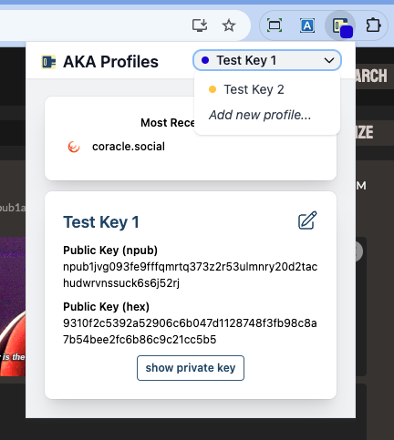
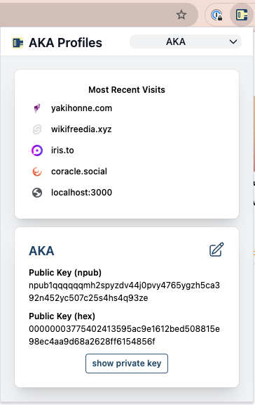

This is a personal project & Lightning tips or a quick thank you is appreciated.\
Nostr: [neilck](https://coracle.social/people/nprofile1qythwumn8ghj7un9d3shjtnswf5k6ctv9ehx2ap0qywhwumn8ghj7mn0wd68ytfsxgh8jcttd95x7mnwv5hxxmmd9uqsuamnwvaz7tmwdaejumr0dshsqgqqqqqqxa65qfqnt9dvnctp90k4pzq4ax8vf25adz3x9rlkz4y9durgmmyv)\
Lightning: tensesing63@walletofsatoshi.com

# AKA Profiles

## Nostr signer extension with multiple keys

AKA Profiles is a [Chrome Extension](https://chrome.google.com/webstore/detail/aka-profiles/ncmflpbbagcnakkolfpcpogheckolnad), based on [nos2x](https://github.com/fiatjaf/nos2x) and adds support for multiple public / private key pairs.

The primary purpose is enabling web apps to request the signing of events using the locally stored private key, thereby eliminating the need to give the private key to web apps.

It also stores a list of your public keys, reducing copying / pasting of keys into various apps.

To install latest version, download V1.0.9-\*.zip and extract files. Then search for "how to load unpacked extension in Chrome".

## Version 1.09

Thanks to [@robwoodgate](https://github.com/robwoodgate) signString() is now supported. This allows applications (clients) to pass in a message string, and get a signed hash using your private key.

See [NIPS PR-1842](https://github.com/nostr-protocol/nips/pull/1842) for more information.

Note that the message can not be a JSON object (to prevent the signing of Nostr events using signString() instead of signEvent() which would bypass permission checks).

## Version 1.08

Thanks to [@Tezar](https://github.com/Tezar) it's now easy to tell which key is the current key based on the icon's badge color.

## Version 1.07

Version 1.07 adds Most Recent Visits, allowing one click access to apps.
Apps that have most recently requested getPublicKey() are shown first.
This feature can be enable / disabled in Options.

### Bug Fixes / Improvements

- added NIP-44 support
- disable autocomplete for forms
- updated display names for kinds during permission request
- updated nostr-tools version

## Experimental

- during window.nostr.signEvent(event), if pubkey specified in event, sign event with corresponding private key instead of using current pubkey
- added new function window.nostr.getSharedPublicKeys that returns all public keys previously shared with client. Based on always allow getPublicKey() permission

## Version 1.06

- fixed issued where profile didn't change during permission ask

## Version 1.05

- updated to newer permission model in nos2x
- support for NIP-07 switching accounts
- removed support for signing delegation
- fixed screen width errors

**Supported**

[NIP-07](https://github.com/nostr-protocol/nips/blob/master/07.md)

- getPublicKey()
- signEvent(event)
- getRelays()

[NIP-07 signString()](https://github.com/nostr-protocol/nips/pull/1842) 
- signString()

[NIP-07 switching accounts](https://github.com/nostr-protocol/nips/pull/701)
- window.nostr.on('accountChanged', accountChangedHandler)
  
[NIP-04](https://github.com/nostr-protocol/nips/blob/master/04.md)

- nip04.encrypt()
- nip04.decrypt()
- nip44.encrypt()
- nip44.decrypt()

These javascript functions are made available to web apps through injection of `window.nostr` script element defined in `nostr-provider.js` into the DOM.

AKA Profiles uses the same app permission model as nos2x

## User Guide

### Compiling

`npm run build`

The built extension files are written to `dist` folder.

### Installation

Install from [Chrome Web Store](https://chrome.google.com/webstore/detail/aka-profiles/ncmflpbbagcnakkolfpcpogheckolnad),

Otherwise, use the files in the `dist` folder after compiling:

1. Open Chrome browser and paste `chrome://extensions` into the address bar.
2. Enable Developer mode by clicking Developer mode toggle (top right)
3. Click Load Unpacked button in the menu bar.
4. Select the `dist` folder.
5. Click the Extension icon in Chrome, and click AKA Profiles icon.
6. Paste in your private key.

### Tips

- "Add new profile..." is available in dropdown in top right
- Right click on AKA Profiles icon and select Options to revoke app permissions or to add preferred relays

If Access Request prompt dialog doesn't appear when loading a web page

- Check to see if it is already open, but got hidden behind the current window
- Ensure other signer extensions are not also enabled (e.g. nos2x, Alby)

## Integration Examples

To integrate, see the following compatible web apps

- [Nostr.chat](https://nostr.chat) - [repo](https://github.com/NostrChat/NostrChat)
- [Snort.social](https://snort.social) - [repo](https://git.v0l.io/Kieran/snort)
- [nostra.me](https://nosta.me/) - [repo](https://github.com/GBKS/nosta-me)

Search repositories for `window.nostr.getPublicKey()`

## Developer Notes

As much underlying code as possible was reused from `nos2x`. For reference, this is how both `AKA Profiles` and `nos2x` processes application requests.

As specified in [NIP-07](https://github.com/nostr-protocol/nips/blob/master/07.md), the browser extension's `contentScript.js` injects nostr-provider.js script into element `window.nostr` on page load. The calling application needs to wait for the insertion before accessing.

Functions like `window.nostr.getPublicKey()` are defined in nostr-provider.js, and when called, post a message (`window.postMessage`) with `ext: "aka-profiles"`.

`contentScript.js`, which runs in the context of the web page, listens for those messages, and in turn sends the message (`browser.runtime.sendMessage`) to `background.js`.

`background.js` then processes the request, opening up a new window if user interaction is necessary. The result is then returned as as response back up the chain of message senders.
